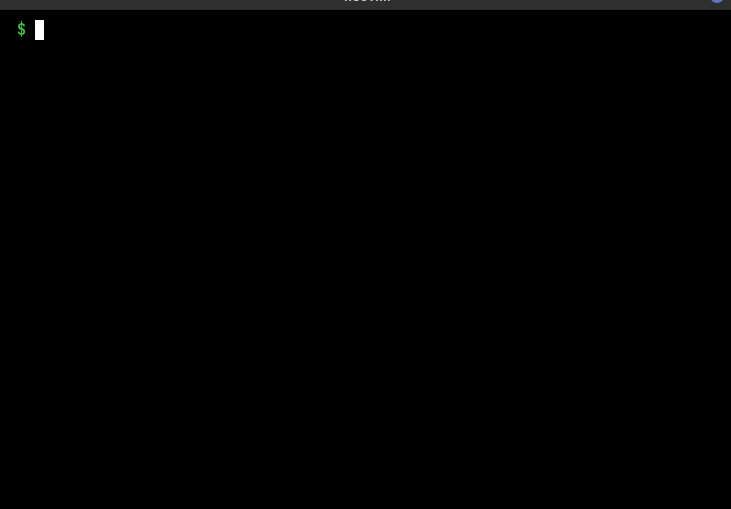
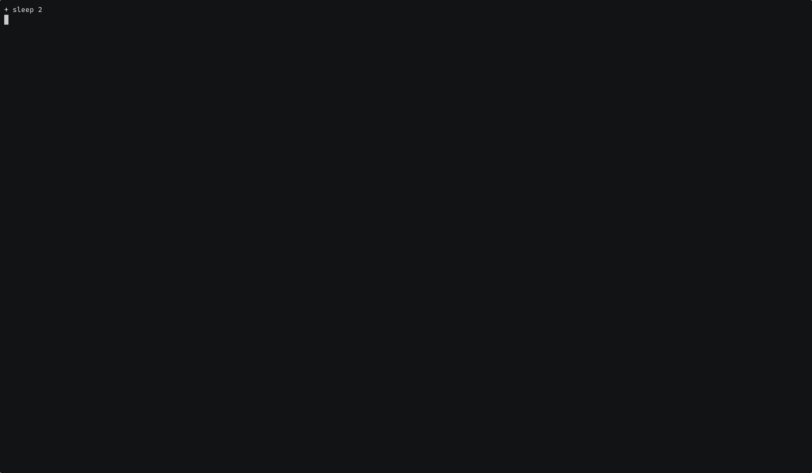

# `dotback`

`dotback` backs up your dotfiles.

Instead of making confusing and outright dangerous symlinks, this simply backs up your dotfiles using a `toml` file.

<!-- TOC start (generated with https://github.com/derlin/bitdowntoc) -->

- [`dotback`](#dotback)
   * [Features](#features)
   * [Configuration](#configuration)
   * [Usage](#usage)
      + [Backup](#backup)
   * [Unix philosophy](#unix-philosophy)
   * [It does not](#it-does-not)
   * [It does](#it-does)
   * [Installation](#installation)
   * [Contribution](#contribution)

<!-- TOC end -->

## Features

- A single binary, no runtime environments or large dependencies.
- Designed with Unix philosophy, it only does backup.

## Installation

You can download the binary from the [releases](https://github.com/pspiagicw/dotback/releases) section.

If you have the `Go` compiler installed, you can also install it using the following command.

```sh
go install github.com/pspiagicw/gox@latest
```

If you use [`gox`](https://github.com/pspiagicw/gox) to manage your go binaries, you can also install it using the following command.

```sh
gox install github.com/pspiagicw/gox@latest
```

## Configuration

It tries to find the default configuration in `$XDG_CONFIG_HOME/dotback/backup.toml`.
- It should have a `storeDir` variable defined. 
- It can optionally provide a `after-backup` list of commands to run.

> You can also run `dotback --example-config` to get an example config file.

```toml

# A folder to store the backup, it will be created if it does not exist.
storeDir = "~/.local/state/backup"

# All commands should be defined by the user.
# It can be left empty or omitted.

after-backup = [
    "scp -r ...",
    "rsync ....",
    "tar -xvzf ..."
]


# A backup rule has [backup.<rule-name>] format.
# It should contain a `location` parameter.
[backup.nvim]
location = "~/.config/nvim"

[backup.neomutt]
location = "~/.config/neomutt"

# Backup location can also be a file.
[backup.gitconfig]
location = "~/.gitconfig"

```

> You can run `dotback config` to get info about the current config.



## Usage

### `flags`
`dotback` provides the following flags.
- `--config` : Path to a alternate config file. (Should be absolute path)
- `--example-config` : Print an example config file.

### `backup`

Simply run `dotback backup` to backup configured in the config file. 
- It would backup everything to `storeDir`.
- This ignores `.git` and `.gitignore` files within any backup folder.


- You can also specify selective rules for backup. 

```sh
# Only backup neovim config
dotback backup nvim
```

- You can also provide `--ignore` flag to ignore selective rules for backup.

```sh
# Backup everything except neovim and neomutt
dotback backup --ignore nvim neomutt
```



- You can provide `--dry-run` flag to not actually backup anything.

```sh
# Don't actually backup anything
dotback backup --dry-run
```


## Unix philosophy

`dotback` is not a full fledged backup solution for your dotfiles. It is a simple tool with a simple use.

## `it does not`
- Provide incremental backup (Use rsync or borg)
- Provide automatic backup (Use systemd or cron for that) 
- Sync with different machines (Use syncthing for that)
- Install your dotfiles on a new machine.

## `it does`
- Copy the file or folder into the `storeDir`.
- Provide ability to run scripts before and after running the backups.

You can see the backup.yml example file(in the repo) for more reference.


## Contribution

It is a very highly opinated tool. It does not fit in everybody's workflow.
But if it does, please do share your support and love.

Anybody is welcome to contribute and extend this project. 
