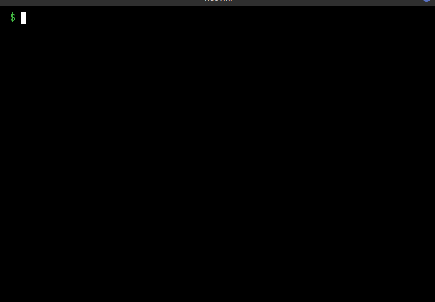

# `dotback`

`dotback` is a small CLI that backs up dotfiles by copying files/directories defined in a TOML config.

## Features

- Single static binary, no runtime environment required.
- Focused scope: backup only.
- Plain copy workflow (no symlink management, no restore workflow).
- Optional post-backup commands (`after-backup`).

## Installation

Download a release binary from [releases](https://github.com/pspiagicw/dotback/releases), or install with Go:

```sh
go install github.com/pspiagicw/dotback@latest
```

If you use [`gox`](https://github.com/pspiagicw/gox):

```sh
gox install github.com/pspiagicw/dotback@latest
```

## Configuration

Default config path:

- `$XDG_CONFIG_HOME/dotback/backup.toml` (typically `~/.config/dotback/backup.toml`)

You can print a starter config:

```sh
dotback --example-config
```

You can inspect loaded config values:

```sh
dotback config
```

### Config schema

- `storeDir` (required): destination root for backups. Created if missing.
- `[backup.<name>]` (required): each rule must include:
- `location` (required): file or directory to copy.
- `after-backup` (optional): commands to run after backup completes.
- `ignore` (optional): glob patterns used to skip paths during copy.

Example:

```toml
storeDir = "~/.local/state/backup"

after-backup = [
  "tar -czf ~/.local/state/backup.tgz ~/.local/state/backup"
]

ignore = [
  "*/node_modules/*",
  "*/.cache/*"
]

[backup.nvim]
location = "~/.config/nvim"

[backup.gitconfig]
location = "~/.gitconfig"
```

More examples: `backup.example.toml`.



## Usage

Global flags:

- `--config`: alternate config file path.
- `--example-config`: print an example config and exit.

### Backup command

Back up all configured rules:

```sh
dotback backup
```

Back up selected rules:

```sh
dotback backup nvim gitconfig
```

Back up all except selected rules:

```sh
dotback backup --ignore nvim neomutt
```

Show planned operations without copying:

```sh
dotback backup --dry-run
```

Use an alternate config:

```sh
dotback --config /absolute/path/to/backup.toml backup
```

Run without interactive prompts (CI/cron):

```sh
dotback backup --non-interactive --no-after-backup
```

List configured backup rule names:

```sh
dotback list
```

Notes:

- `dotback backup` asks for confirmation before starting.
- If `after-backup` is configured, `dotback` asks before running those commands.
- `.git` directories are always skipped during directory copy.
- `.gitignore` files are skipped during copy.


## Limitations

- Not incremental/versioned backup.
- Not scheduling/automation (use cron/systemd).
- Not sync/replication across machines (use rsync/syncthing/etc.).
- Not a restore/installer tool.
- Rule targets with the same basename can overwrite each other in `storeDir` because destination uses the source basename.

## Safety notes

- If you include sensitive paths (for example `~/.ssh`, `~/.gnupg`, password stores), secure `storeDir` with strict permissions.
- If you copy backups to remote storage in `after-backup`, ensure transport and destination are encrypted/protected.

## Contribution

Contributions are welcome on [GitHub](https://github.com/pspiagicw/dotback).
